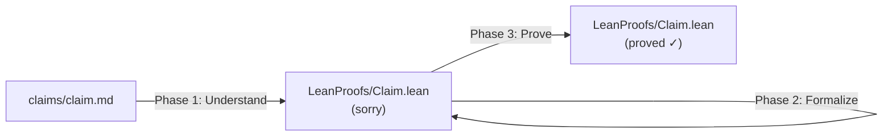
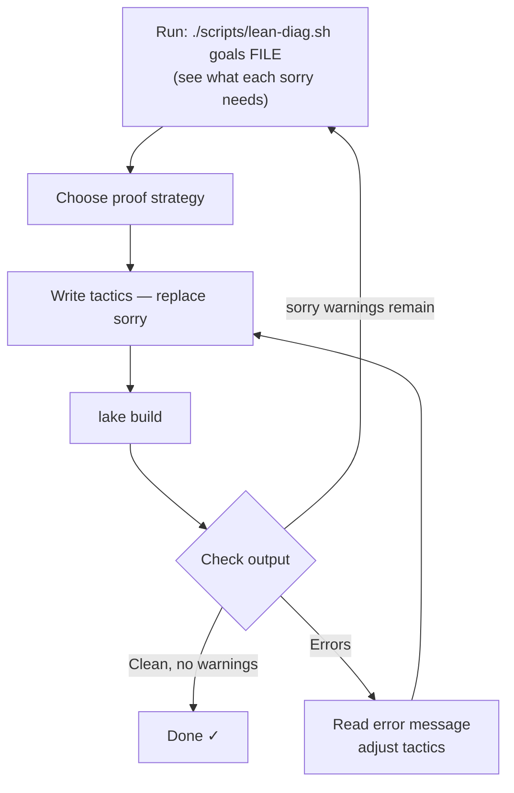
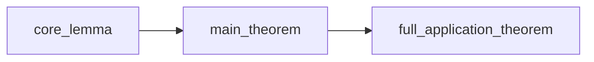

# Lean Theorem Prover

Take a mathematical claim from plain language through to a machine-checked Lean 4
proof. The pipeline has three phases, and you may enter at any phase depending on
what already exists.



## Deciding Where to Start

Check what already exists:

- **Only a claim markdown** → start at Phase 1
- **Lean file with `sorry`** → start at Phase 3 (the claim is already formalized)
- **User describes math in conversation** → create the claim file first, then Phase 1
- **`lake build` shows sorry warnings** → go straight to Phase 3

---

## Phase 1: Understand the Claim

Read `claims/<claim>.md` and extract:

1. **Objects** — what mathematical structures appear (matrices, sets, functions, groups…)
2. **Properties** — what's being asserted (equality, independence, bounds, existence…)
3. **Proof sketch** — the informal argument (if given). Identify the *core algebraic fact* — the simplest, most general statement at the heart of the claim. Everything else builds on it.
4. **Decomposition** — does the claim split into sub-lemmas? Identify them.

This understanding directly shapes both the Lean types you choose and the proof strategy.

---

## Phase 2: Formalize (Claim → Lean Skeleton)

### Choosing Mathlib Types

Map the math to Lean/Mathlib:

| Math concept | Lean/Mathlib type | Typical type classes |
|---|---|---|
| Matrix A ∈ R^{m×n} | `Matrix m n R` | `[Fintype n] [DecidableEq n]` |
| Finite sum ∑ | `Finset.sum` / `∑` notation | `[Fintype ι]` |
| Ring/field | `R` with `[CommRing R]` or `[Field R]` | |
| Vector space | `Module R M` | `[AddCommMonoid M]` |
| Function composition | `g ∘ f` or `Function.comp` | |

Use `import Mathlib` to get everything. Narrow imports later if needed.

### File Structure

Follow the project convention:

```lean
/-
# Title — what this file proves

Mathematical context, setup, and references.
-/

import Mathlib

open RelevantNamespace₁ RelevantNamespace₂

namespace ClaimName

variable {R : Type*} [CommRing R]  -- base type + constraints

/-! ### Core lemma -/

/-- Docstring explaining the mathematical content. -/
theorem core_lemma (args...) (hypotheses...) : conclusion := by
  sorry

/-! ### Main theorem -/

/-- Docstring — builds on core_lemma to state the full claim. -/
theorem main_theorem (args...) (hypotheses...) : conclusion := by
  sorry

end ClaimName
```

### Formalization Principles

**Generalize.** Use type variables (`{m n : Type*}`) and type classes rather than
concrete types. A lemma about "column j of any matrix product" is more useful than
one about "column j of a 3×5 matrix."

**Decompose into a proof chain.** Start with the most general algebraic fact, then
build application-specific theorems on top. This mirrors how informal math works and
makes each proof short.

**Name like Mathlib.** Use descriptive names: `mul_col_eq`, `harmony_per_feature_independence`
— not `lemma1`, `lemma2`.

**Match the math.** The type signature should read like the mathematical statement.
If the claim says "for all cells i," write `∀ (i : n)`.

**Type class hygiene.** Include exactly what's needed — no more, no less. For matrix
proofs over a ring, the standard set is `[CommRing R] [Fintype n] [DecidableEq n]`.

### After Creating the Skeleton

1. Add `import LeanProofs.ClaimName` to `LeanProofs.lean`
2. Run `lake build` — expect `sorry` warnings but zero errors
3. If there are parse errors, fix the skeleton before attempting proofs

---

## Diagnostic Tools

### `scripts/lean-diag.sh`

```bash
./scripts/lean-diag.sh status          # overview: sorry count, errors, per-file summary
./scripts/lean-diag.sh goals FILE.lean # show goal state at each sorry
./scripts/lean-diag.sh check           # just pass/fail build check
```

The `goals` subcommand is the most important — it inserts `trace_state` before each
`sorry`, runs the elaborator, and prints what needs to be proved at each position.
**Always run `goals` before writing tactics** to see the exact goal shape. This
replaces the interactive goal view you'd get from an editor's Lean integration.

---

## Phase 3: Prove (sorry → Verified)

This is the core loop. Repeat until the build is clean:



### Step 1: Dependency Analysis

Before writing any proof, scan all the `sorry` theorems and identify dependencies.
If theorem B's natural proof applies theorem A, then prove A first. Draw the chain:



Prove left to right.

### Step 2: Strategy Selection

Read the theorem's type signature. The *shape of the goal* tells you which strategy to use:

| Goal shape | Strategy | Key tactic |
|---|---|---|
| `f = g` (function equality) | Extensionality | `ext x` then prove pointwise |
| `∑ k, f k = ∑ k, g k` | Sum congruence | `apply Finset.sum_congr rfl` then prove each term equal |
| Goal contains a definition | Unfold it | `simp only [def_name, ...]` |
| Hypothesis `h : a = b`, goal has `a` | Rewrite | `rw [h]` |
| Earlier lemma gives exactly the goal | Direct application | `exact earlier_lemma args` |
| `∀ x, P x` | Introduce | `intro x` |
| `f a = f b`, need `a = b` | Congruence | `congr 1` |
| `h : f = g`, need `f x = g x` | Function application | `exact congr_fun h x` |

### Step 3: Write Tactics

These patterns recur across proofs in this repo:

**Unfold–Simplify–Close** — for definitional equalities:
```lean
ext i
simp only [definition₁, definition₂]
exact Finset.sum_congr rfl fun k _ => by rw [h k]
```

**Chain Through Earlier Lemma** — when a corollary follows from the core fact:
```lean
intro b
exact congr_fun (core_lemma args) b
```

**Lift Pointwise to Sum** — when a sum's terms are individually equal:
```lean
apply Finset.sum_congr rfl
intro k _
rw [earlier_theorem args]
```

Keep proofs to 2–6 tactic lines. If a proof grows beyond ~8 lines, the theorem
likely needs to be decomposed into sub-lemmas — go back and add an intermediate
`theorem` or `lemma`.

### Step 4: Build and Interpret Errors

Run `lake build` after each theorem (or batch of related theorems). Read the output:

| Error | Likely cause | Fix |
|---|---|---|
| `declaration uses sorry` (warning) | More theorems to prove | Expected — continue to next sorry |
| `type mismatch` | Tactics built the wrong proof term | Check what was expected vs produced; `simp` may have gone too far |
| `unknown identifier 'X'` | Typo or missing lemma | Search: `grep -r "X" .lake/packages/mathlib/Mathlib/` |
| `unsolved goals` | Proof is incomplete | Need more tactic steps |
| `failed to synthesize instance` | Missing type class in signature | Add the required `[Instance]` constraint |
| `function expected at` | Applied a non-function | Check parentheses and implicit args |

**When stuck after 2–3 attempts on the same error:**
1. Try a completely different proof strategy
2. Break the proof with an intermediate `have` step
3. Use `Finset.sum_congr`, `congr`, or `ext` to reduce the goal to something simpler
4. Consult the tactic playbook: `references/tactic_playbook.md`

### Step 5: Finalize

After all `sorry`s are gone and `lake build` is clean:

- Verify zero `sorry` warnings in the build output
- Update the claims table in `CLAUDE.md` — set status to `proved`
- Keep each proof short and readable

---

## Tips

- **Trust definitional equality.** Lean's kernel handles beta reduction. If
  `colOf A j i` and `A i j` are definitionally equal, you often don't need `unfold`.

- **`simp only` over `simp`.** Full `simp` is slow and unpredictable. Control
  exactly what gets rewritten with `simp only [lemma₁, lemma₂]`.

- **Read error messages literally.** Lean's type errors show the expected and
  actual types — the mismatch usually points directly to the fix.

- **Proofs should be boring.** If a proof feels clever or surprising, the
  theorem decomposition is probably wrong. Restructure so each step is obvious.

- **When the math is clear, the tactics write themselves.** Spend more time
  understanding the claim than guessing at tactics.
